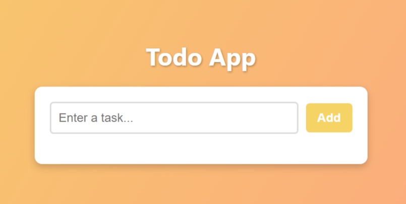
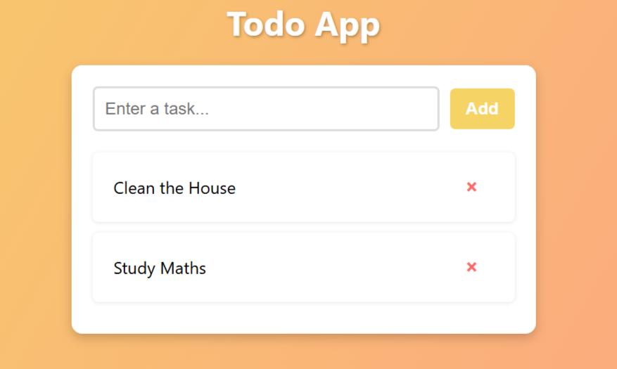
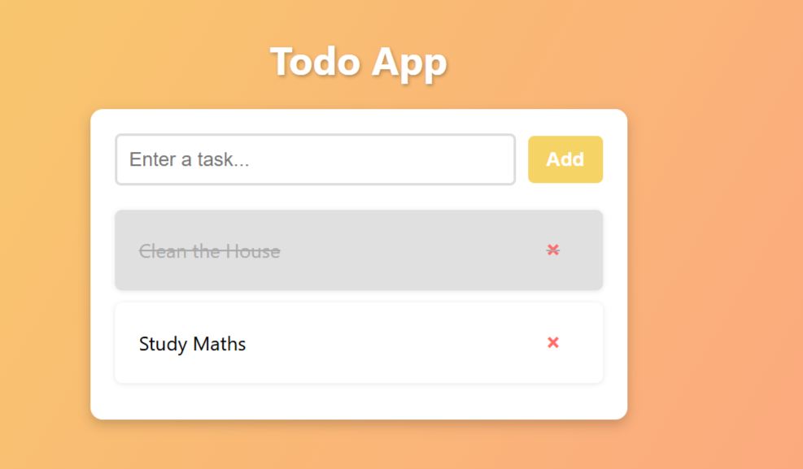
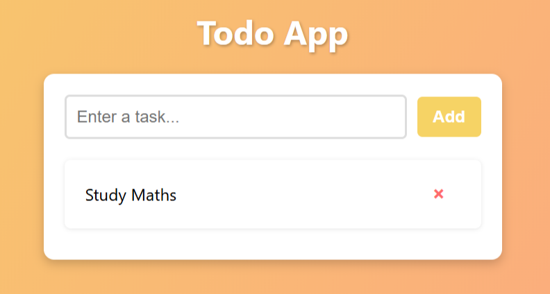

# 📝 Todo List App

 **Todo List Web Application** that allows users to:

- Add tasks
- Mark tasks as completed
- Delete tasks

This project is built using **HTML, CSS, and JavaScript only**.  

---

## 🚀 Getting Started

### ✅ Requirements
- A modern web browser (Chrome, Firefox, Edge, etc.)
- [Optional] A local server like **Live Server** for a smoother experience

---

## 📦 Run Locally

Clone the repository and navigate to the project directory:

```bash
git clone https://github.com/dagm24/A2SV-Web-Project.git
cd A2SV-Web-Project
cd Task-1
```

Open `ToDo.html` directly in your browser, **or** use a local server like **Live Server (VS Code extension)** for the best experience.

## 📷 Screenshots

### 🔹 Home Page – No Tasks Yet

The app displays a message when there are no tasks in the list:

> **"No tasks yet."**


### 🔹 Add New Task

Users can add a new task using the input field.

> Type a task into the input field and click **"Add"** to add it to the list.



### 🔹 Mark Task as Done

Users can mark a task as completed by clicking.

> Completed tasks will have a **line-through** style.



### 🔹 Delete Task

Tasks can be removed from the list by clicking the **X** button.

> Once deleted, the task is removed instantly.  



## 📁 Project Structure

Task-1/
│
├── ToDo.html
├── style.css
├── script.js 
├── README.md 
└── screenshots/


