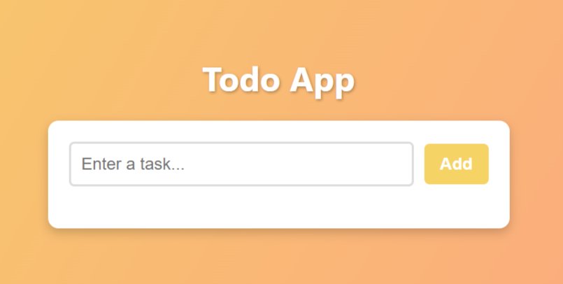
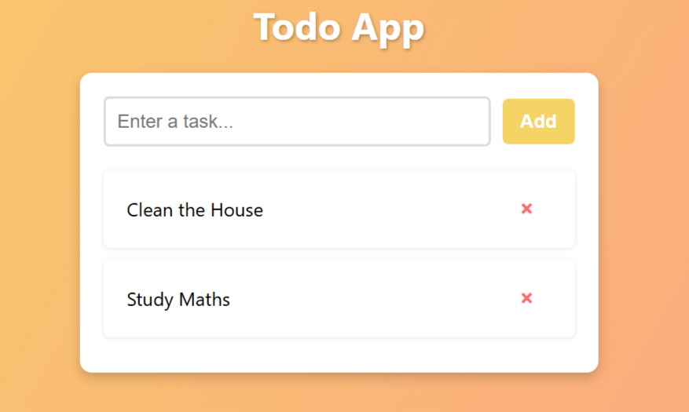
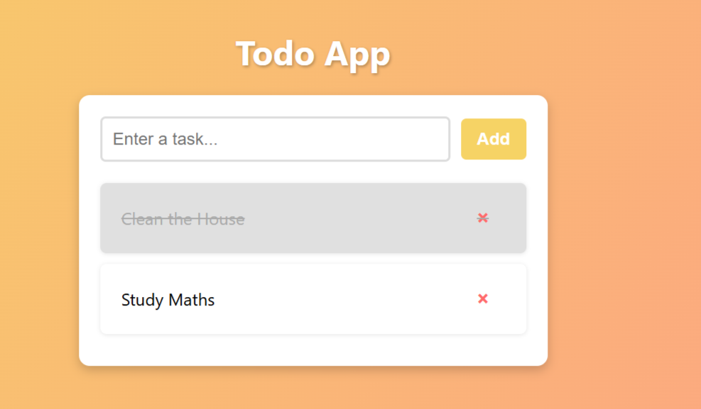
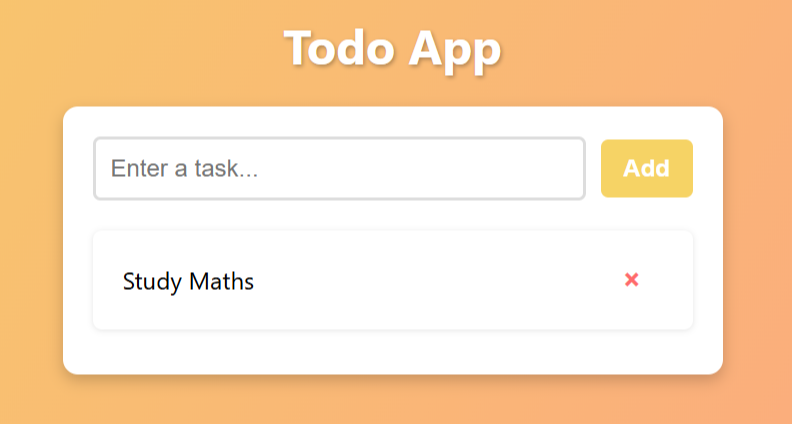

# 📝 Todo List App (TypeScript)

A **Todo List Web Application** built with TypeScript, HTML, and CSS. This app allows users to:

- Add tasks
- Mark tasks as completed
- Delete tasks

---

## 🚀 Getting Started

### ✅ Requirements
- A modern web browser (Chrome, Firefox, Edge, etc.)
- [Optional] A local server like **Live Server** for a smoother experience

---

## 📦 Run Locally

Clone the repository and navigate to the project directory:

```bash
git clone https://github.com/dagm24/A2SV-Web-Project.git
cd A2SV-Web-Project/Task-2
```

Then open `public/ToDo.html` directly in your browser, **or** use a local server like **Live Server (VS Code extension)** for the best experience.

---

## 📁 Project Structure

```
Task-2/
│
├── public/
│   ├── ToDo.html
│   └── style.css
├── src/
│   └── todo.ts
├── dist/
│   └── todo.js
└── README.md
```

---

## ⚙️ How It Works
- **Add a Task:** Enter a task in the input field and click **Add**.
- **Mark as Completed:** Click on a task to toggle its completed state (line-through style).
- **Delete a Task:** Click the **×** button next to a task to remove it.

---

## 🛠️ Built With
- TypeScript
- HTML5
- CSS3

---

## 📷 Screenshots

### 🔹 Home Page – No Tasks Yet

The app displays a message when there are no tasks in the list:

> **"No tasks yet."**


### 🔹 Add New Task

Users can add a new task using the input field.

> Type a task into the input field and click **"Add"** to add it to the list.



### 🔹 Mark Task as Done

Users can mark a task as completed by clicking.

> Completed tasks will have a **line-through** style.



### 🔹 Delete Task

Tasks can be removed from the list by clicking the **X** button.

> Once deleted, the task is removed instantly.  



---


