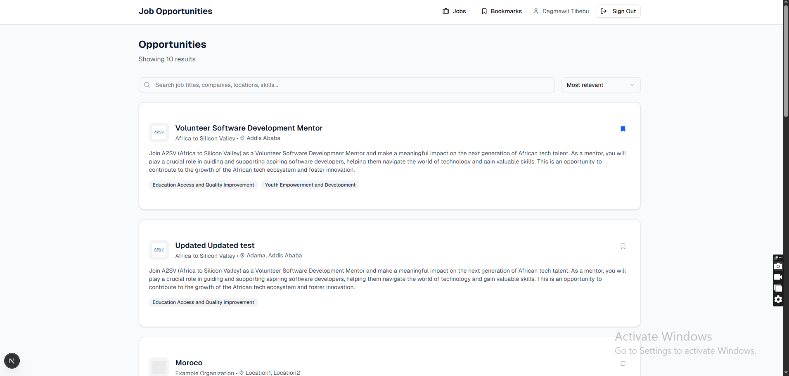
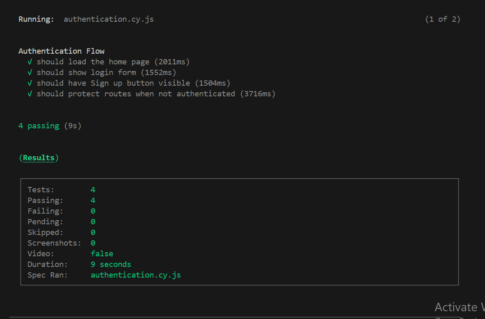
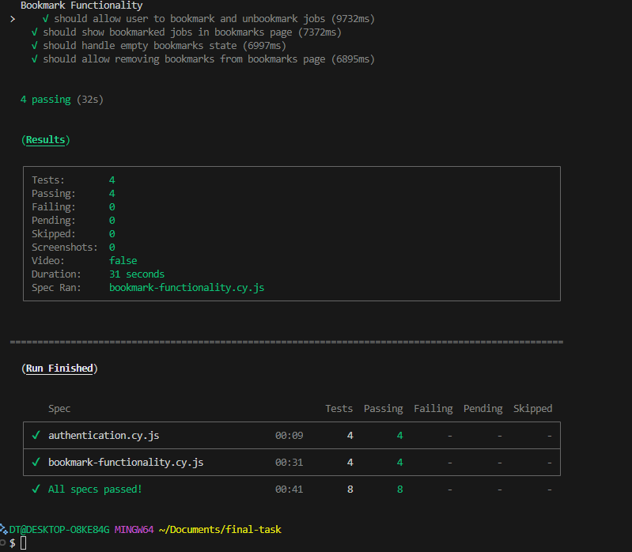
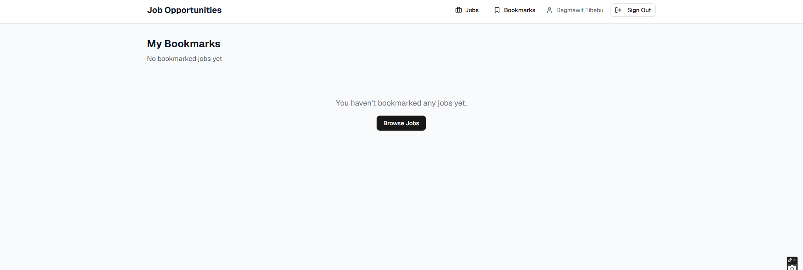
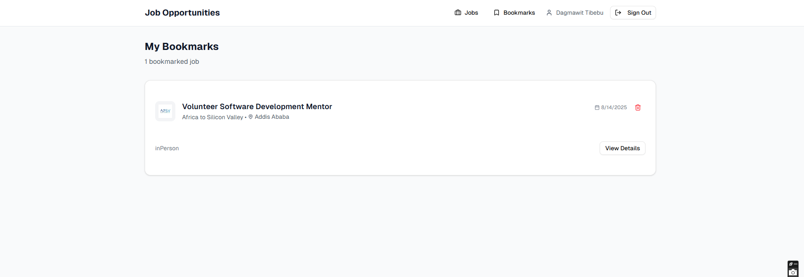

# Job Listing Application

A modern job listing application built with Next.js, TypeScript, and Tailwind CSS, featuring authentication, job search, and bookmark functionality.

## Features

- **Authentication System**: Secure login and registration with JWT tokens
- **Job Listings**: Browse and search through job opportunities
- **Job Details**: Detailed view of job postings with comprehensive information
- **Bookmark Functionality**: Save and manage favorite job listings
- **Real-time Search**: Search jobs by title, company, location, and skills
- **API Integration**: Full integration with backend APIs

## Tech Stack

- **Frontend**: Next.js 15, React 19, TypeScript
- **Styling**: Tailwind CSS v4, shadcn/ui components
- **State Management**: Zustand with persistence
- **Testing**: Jest for unit tests, Cypress for E2E tests
- **API**: RESTful API integration with https://akil-backend.onrender.com

## Getting Started

### Prerequisites

- Node.js 18+
- npm or yarn

### Installation

1. Clone the repository
2. Install dependencies:
   \`\`\`bash
   npm install
   \`\`\`

3. Start the development server:
   \`\`\`bash
   npm run dev
   \`\`\`

4. Open [http://localhost:3000](http://localhost:3000) in your browser

## Testing

### Unit Tests (Jest)

Run unit tests:
\`\`\`bash
npm test
\`\`\`

Run tests in watch mode:
\`\`\`bash
npm run test:watch
\`\`\`

### End-to-End Tests (Cypress)

Open Cypress test runner:
\`\`\`bash
npm run cypress:open
\`\`\`

Run Cypress tests headlessly:
\`\`\`bash
npm run cypress:run
\`\`\`

## API Endpoints

### Authentication

- `POST /login` - User login
- `POST /signup` - User registration

### Jobs

- `GET /opportunities/search` - Get job listings

### Bookmarks

- `GET /bookmarks` - Get user bookmarks
- `POST /bookmarks/:eventID` - Bookmark a job
- `DELETE /bookmarks/:eventID` - Remove bookmark

## Project Structure

\`\`\`
├── app/ # Next.js app directory
│ ├── dashboard/ # Dashboard page
│ ├── job/[id]/ # Job detail pages
│ ├── bookmarks/ # Bookmarks page
│ └── page.tsx # Home/login page
├── components/ # React components
│ ├── auth/ # Authentication components
│ ├── jobs/ # Job-related components
│ ├── layout/ # Layout components
│ └── ui/ # shadcn/ui components
├── lib/ # Utility libraries
│ ├── auth.ts # Authentication store
│ ├── bookmarks.ts # Bookmarks store
│ ├── jobs-api.ts # Jobs API integration
│ └── api.ts # API utilities
├── types/ # TypeScript type definitions
├── **tests**/ # Jest unit tests
└── cypress/ # Cypress E2E tests
\`\`\`

## Screenshots

Below are a few screenshots of the app. Files are located in the `screenshoots/` folder.

- Landing page

  

- Authentication flow (E2E)

  

- Dashboard bookmark interaction (E2E)

  

- Bookmarks page (empty and populated states)

  

  

### Testing Strategy

- **Unit Tests**: Component rendering, user interactions, API calls
- **E2E Tests**: Complete user workflows, authentication flows, bookmark functionality
