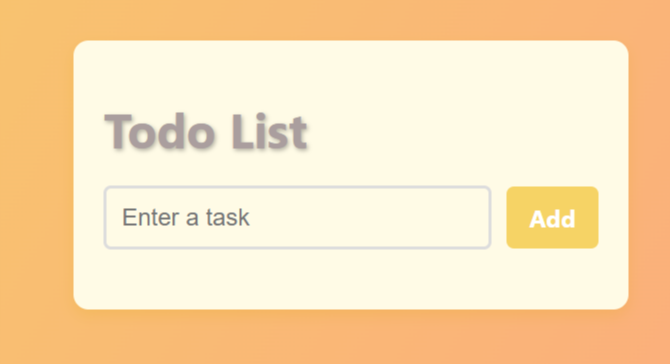
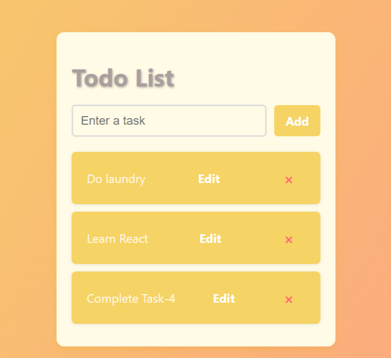
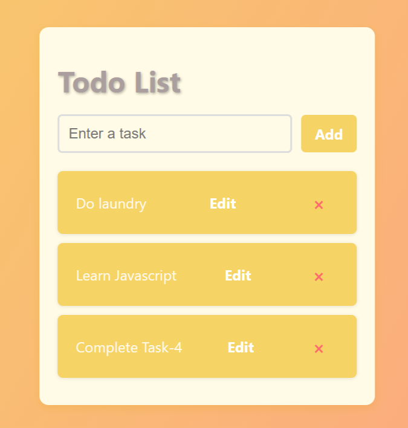
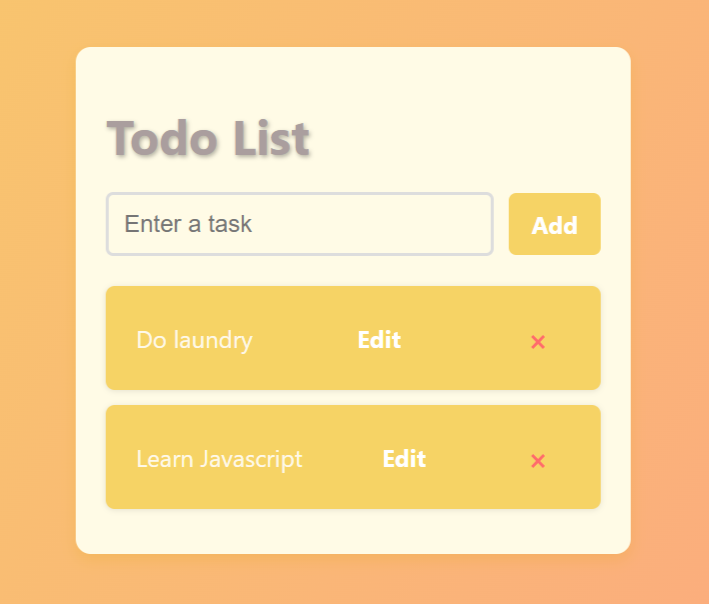

# 📝 Todo List App (React + TypeScript)

A **Todo List Web Application** built with React, TypeScript, and CSS. This app allows users to:

- Add tasks
- Edit tasks
- Delete tasks

---

## 🚀 Getting Started

### ✅ Requirements
- A modern web browser (Chrome, Firefox, Edge, etc.)
- [Optional] A local server like **Vite** or **Live Server** for a smoother experience

---

## 📦 Run Locally

Clone the repository and navigate to the project directory:

```bash
git clone https://github.com/dagm24/A2SV-Web-Project.git
cd A2SV-Web-Project/task-4
npm install
npm run dev
```

Then open the local server URL in your browser (usually `http://localhost:5173`).

---

## 📁 Project Structure

```
task-4/
│
├── public/
│   └── index.html
├── src/
│   ├── App.tsx
│   ├── App.css
│   ├── types.ts
│   ├── components/
│   │   ├── TodoList.tsx
│   │   └── TodoItem.tsx
│   └── ...
├── package.json
├── tsconfig.json
└── README.md
```

---

## ⚙️ How It Works
- **Add a Task:** Enter a task in the input field and click **Add**.
- **Mark as Completed:** Click the checkbox next to a task to toggle its completed state (line-through style).
- **Edit a Task:** Click the **Edit** button next to a task, change the text, and click **Save**.
- **Delete a Task:** Click the **×** button next to a task to remove it.

---

## 🛠️ Built With
- React
- TypeScript
- CSS3
- Vite

---

## 📷 Screenshots

### 🔹 Home Page – No Tasks Yet

The app displays a message when there are no tasks in the list:

> **"No tasks yet."**


### 🔹 Add New Task

Users can add a new task using the input field.

> Type a task into the input field and click **"Add"** to add it to the list.




### 🔹 Edit Task

Users can edit a task by clicking the **Edit** button next to it, changing the text, and clicking **Save**.

> Edited tasks will update instantly in the list.



### 🔹 Delete Task

Tasks can be removed from the list by clicking the **X** button.

> Once deleted, the task is removed instantly.  




---


```
