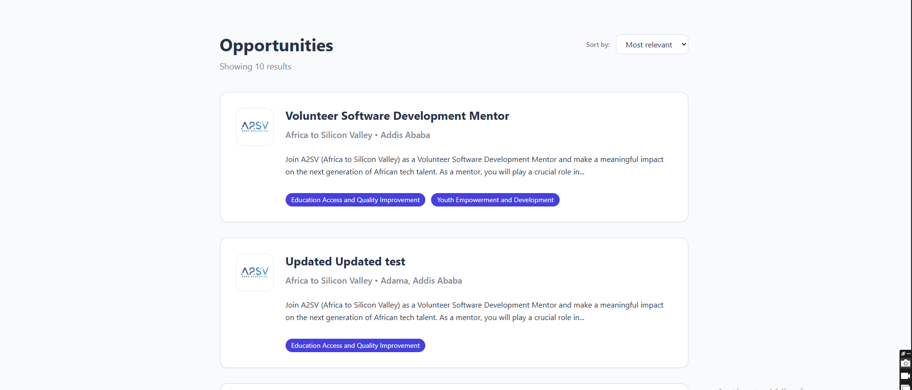
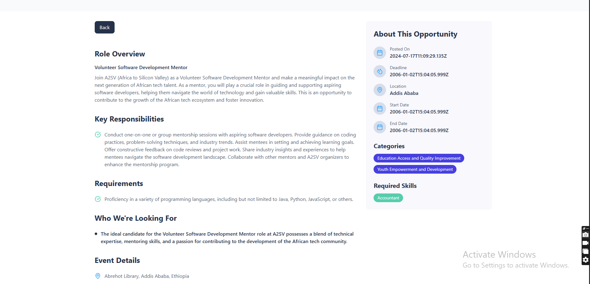

# Task 7: Job Board Dashboard with API Integration

## Overview
This project is a job board dashboard built with React, TypeScript, and Vite. It displays opportunities fetched from a live API, replacing dummy data with real-time information. The UI design is preserved from previous tasks, with all cards and details populated from the API.

## Features
- Fetches opportunities from [API Endpoint](https://akil-backend.onrender.com/opportunities/search)
- Displays job cards with summary info
- Shows detailed view for selected opportunity

## Project Structure
```
task-7/
├── public/
│   └── style.css
├── src/
│   ├── api.ts
│   ├── types.ts
│   ├── App.tsx
│   ├── main.tsx
│   └── components/
│       ├── Dashboard.tsx
│       ├── JobCard.tsx
│       └── JobDetails.tsx
├── package.json
├── tsconfig.json
├── vite.config.ts
└── README.md
```

## Getting Started
1. **Clone the repository:**
   ```bash
   git clone https://github.com/dagm24/A2SV-Web-Project.git
   cd A2SV-Web-Project/task-7
   ```
2. **Install dependencies:**
   ```bash
   npm install
   ```
3. **Run the development server:**
   ```bash
   npm run dev
   ```
4. **Open in browser:**
   Visit `http://localhost:5173` to view the dashboard.

## API Reference
- **Endpoint:** `https://akil-backend.onrender.com/opportunities/search`
- **Response:** Array of opportunity objects with fields like `title`, `description`, `location`, `categories`, `deadline`, `startDate`, `endDate`, etc.

## Customization
- Update UI components in `src/components/` to change layout or styles.
- Modify API logic in `src/api.ts` if endpoint changes.
- Adjust types in `src/types.ts` to match API response.

## Screenshots



### Job Description View




