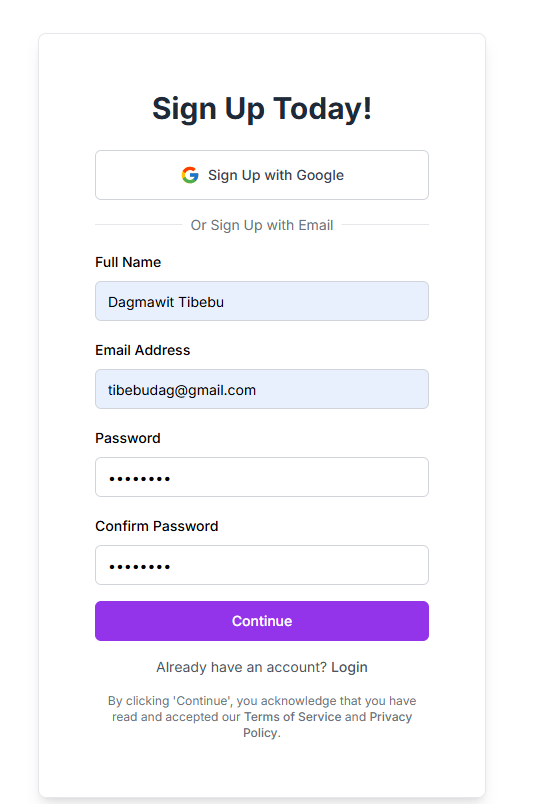
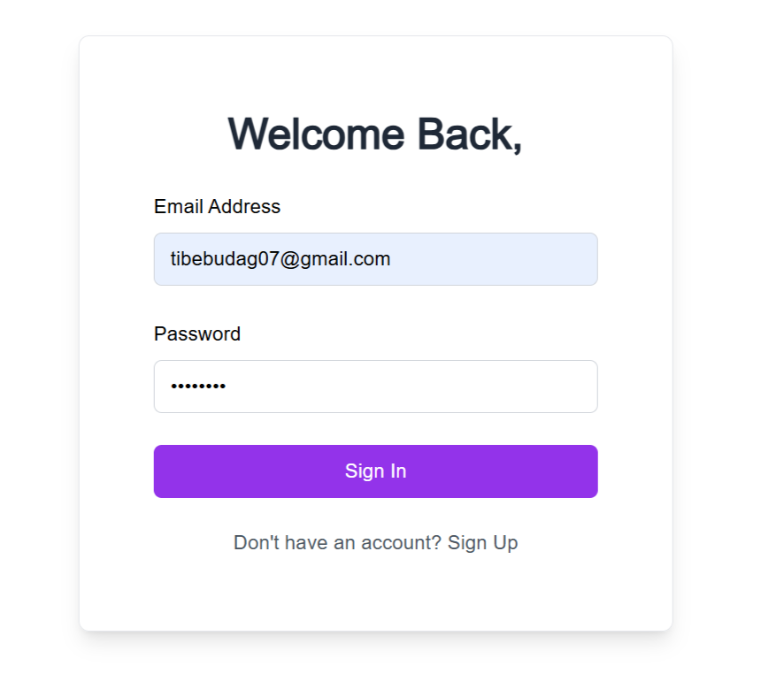
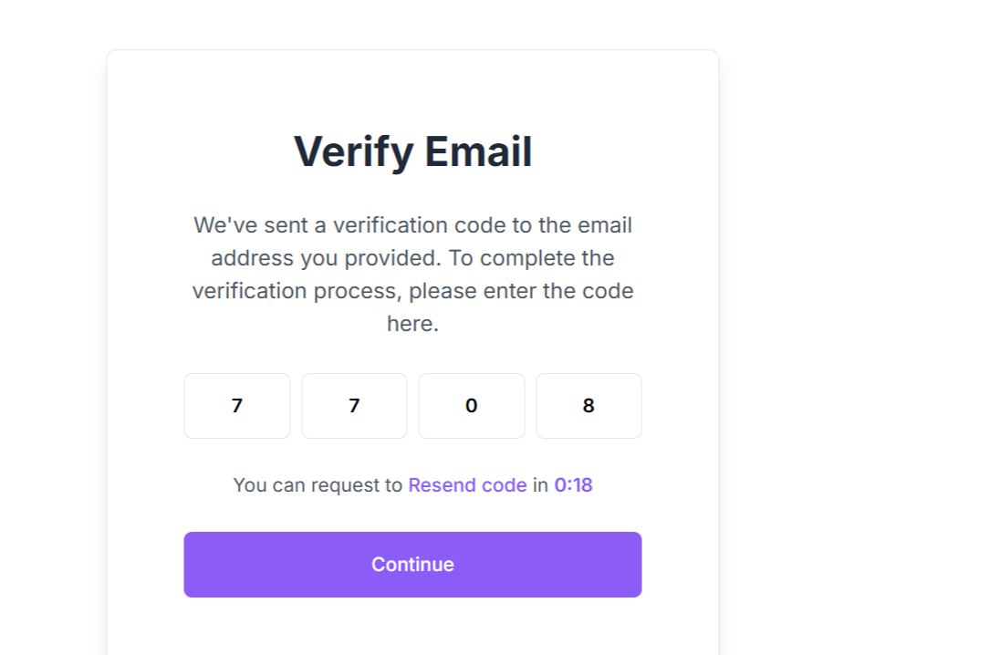

# Authentication App

A modern authentication application built with Next.js 15, TypeScript, Tailwind CSS, and NextAuth.js.

## Features

- **User Registration**: Complete signup flow with email verification
- **User Login**: Secure authentication with NextAuth.js
- **Email Verification**: OTP-based email verification system
- **Modern UI**: Beautiful, responsive design with Tailwind CSS
- **Type Safety**: Full TypeScript support
- **Form Validation**: Client and server-side validation
- **Toast Notifications**: User-friendly feedback with react-hot-toast

## Tech Stack

- **Framework**: Next.js 15 with App Router
- **Language**: TypeScript
- **Styling**: Tailwind CSS
- **Authentication**: NextAuth.js
- **Icons**: React Icons
- **Notifications**: React Hot Toast
- **HTTP Client**: Axios

## Project Structure

```
task-8/
├── app/
│   ├── auth/
│   │   ├── login/          # Login page
│   │   ├── signup/         # Signup page
│   │   └── verify-email/   # Email verification page
│   ├── api/
│   │   └── auth/           # NextAuth API routes
│   ├── actions/            # Server actions
│   ├── globals.css         # Global styles
│   ├── layout.tsx          # Root layout
│   ├── page.tsx            # Home page
│   └── providers.tsx       # Context providers
├── lib/
│   ├── auth.ts             # NextAuth configuration
│   └── utils.ts            # Utility functions
├── src/
│   └── pages/              # Additional pages (legacy)
└── public/                 # Static assets
```

## Getting Started

### Prerequisites

- Node.js 18+ 
- npm or yarn

### Installation

1. Clone the repository
2. Install dependencies:
   ```bash
   npm install
   ```

3. Create a `.env.local` file in the root directory:
   ```env
   NEXTAUTH_SECRET=your-secret-key-here
   NEXTAUTH_URL=http://localhost:3000
   NEXT_PUBLIC_API_BASE_URL=https://akil-backend.onrender.com
   ```

4. Run the development server:
   ```bash
   npm run dev
   ```

5. Open [http://localhost:3000](http://localhost:3000) in your browser

## Available Scripts

- `npm run dev` - Start development server
- `npm run build` - Build for production
- `npm run start` - Start production server
- `npm run lint` - Run ESLint

## API Integration

The app integrates with a backend API at `https://akil-backend.onrender.com` for:
- User registration (`/signup`)
- User authentication (`/login`)
- Email verification (`/verify-email`)

## Authentication Flow

1. **Signup**: User fills out registration form → Backend creates account → Redirect to email verification
2. **Email Verification**: User enters OTP → Backend verifies email → Redirect to login
3. **Login**: User enters credentials → NextAuth handles authentication → Success page

## Key Features

### Form Handling
- Uses React Server Actions for form submissions
- Client-side validation with TypeScript
- Server-side validation and error handling

### UI/UX
- Responsive design that works on all devices
- Loading states and disabled buttons during form submission
- Toast notifications for user feedback
- Modern, clean interface with Tailwind CSS

### Security
- NextAuth.js for secure authentication
- JWT tokens for session management
- Server-side validation of all inputs
- Protected routes and API endpoints

## Environment Variables

| Variable | Description | Required |
|----------|-------------|----------|
| `NEXTAUTH_SECRET` | Secret key for NextAuth.js | Yes |
| `NEXTAUTH_URL` | Base URL for NextAuth.js | Yes |
| `NEXT_PUBLIC_API_BASE_URL` | Backend API URL | Yes |

## Screenshots
- **Signup Page:**
  
  *User registration form with validation and feedback.*
- **Signin Page:**
  
  *User login form with error handling and token display.*
- **Verify Email Page:**
  
  *OTP input for email verification.*